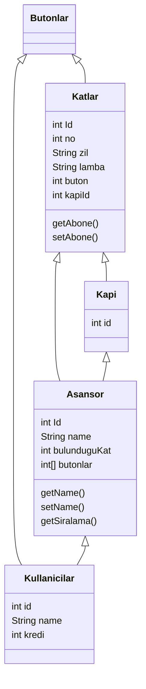

```mermaid
classDiagram
    Katlar <|-- Asansor
    Butonlar <|-- Kullanicilar
    Kapi <|-- Asansor
    Asansor <|-- Kullanicilar
    Butonlar <|-- Katlar
    Katlar <|-- Kapi
 
    
    class Asansor{
    int Id
    String name
    int bulunduguKat
    int[] butonlar
    getName()
    setName()
    getSiralama()        
    }
    class Katlar{
       int Id
       int no
       String zil
       String lamba
       int buton
       int kapiId
       getAbone()
       setAbone()
    }
    class Kullanicilar{
        int id
        String name
        int kredi
    }
    class Kapi{
    int id
    }
    class Butonlar{
    }
    
```
